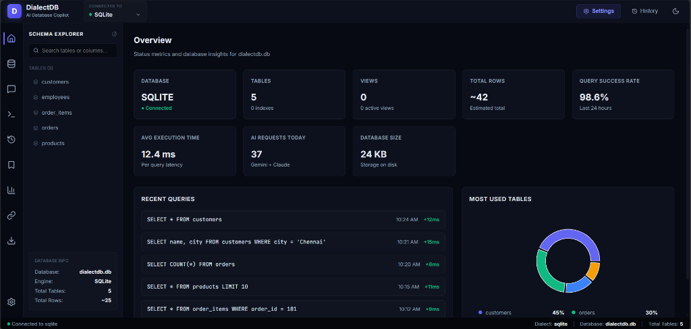
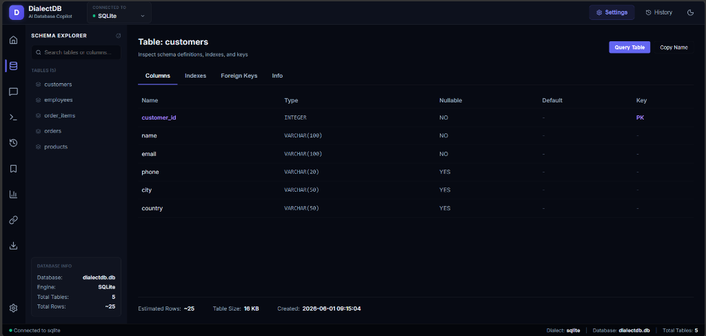
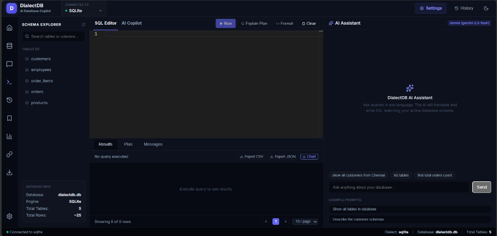
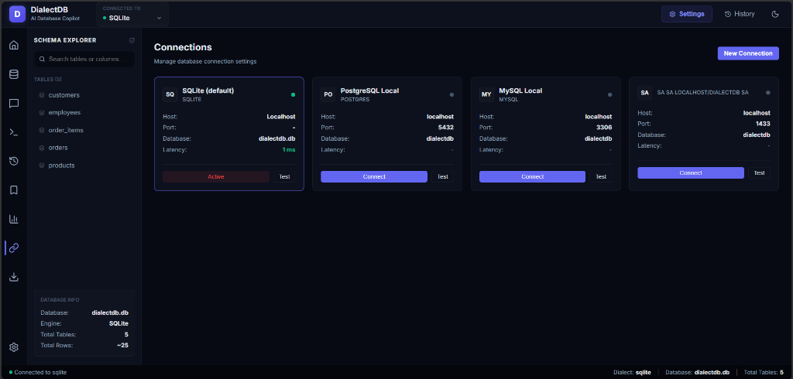
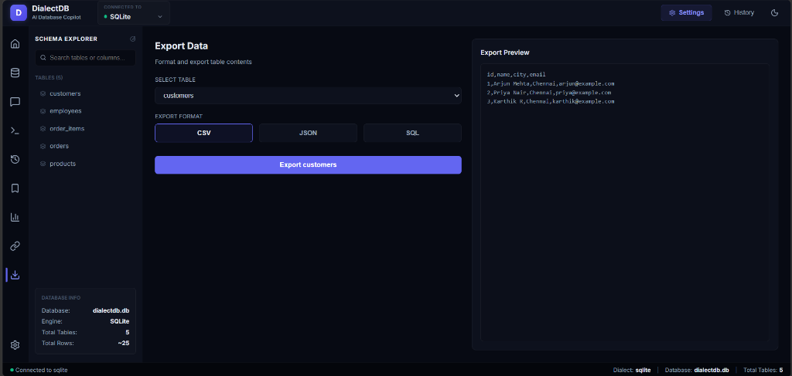

# DialectDB - Intelligent Database Workspace

DialectDB is a next-generation, AI-powered database workspace and IDE. It bridges the gap between raw SQL execution and natural language, allowing developers to query, analyze, and optimize their databases using AI.

---

## 📸 Interactive Showcase

### Dashboard Overview


### Schema Explorer


### SQL Editor & AI Copilot Workspace


### Connections Manager


### Export Center


---

## 🚀 Technology Stack

- **Backend:** FastAPI, Python, SQLAlchemy, Uvicorn
- **Frontend:** React, TypeScript, Monaco Editor, Recharts, Lucide Icons, Vite
- **AI Routing Services:** Google Gemini API (`gemini-2.5-flash`), Anthropic Claude API (`claude-3-5-sonnet`)

---

## 🛠️ Main Workspace Modules

1. **Dashboard:** Database overview metrics including connections, views, index counts, estimated rows count, disk file size, recent query timelines, and Recharts table usage charts.
2. **Schema Explorer:** Direct tree navigation with inline columns dropdown, and a full-pane inspector showcasing table definitions, columns, keys (PK/FK), index definitions, and connection details.
3. **SQL Editor:** Custom Monaco Editor with custom completion provider for SQL keywords, tables, and column fields. Supports hotkey commands (`Ctrl+Enter` to run, `Ctrl+S` to bookmark, `Ctrl+Shift+F` to format).
4. **AI Assistant:** Natural language database partner. Generates SQL, explains execution plans, suggests index optimization, and fixes syntax errors.
5. **Query History:** Execution log tracking latency, rows count, connection source, and execution status.
6. **Saved Queries:** Bookmark SQL scripts with folders and previews.
7. **Connections Switcher:** Multi-database connection manager (SQLite, PostgreSQL, MySQL, SQL Server) with dynamic connection switching.
8. **Analytics:** System load trends, execution latency stats, and table workload bar charts.
9. **Export Center:** Download schemas and row datasets as CSV, JSON, and SQL schema files.
10. **Settings Manager:** Configure model selection thresholds, timeout policies, connection settings, and credentials.

---

## 💻 Getting Started

### 1. Prerequisites
Ensure you have Node.js (v18+) and Python (v3.9+) installed on your machine.

### 2. Configure Credentials
Add your Gemini or Anthropic keys to a `.env.txt` file in the project root:
```env
gemini_key=YOUR_GEMINI_API_KEY
anthropic_key=YOUR_ANTHROPIC_API_KEY
```

### 3. Run the Development Server
Install dependencies and run both the backend and frontend concurrently:
```bash
npm install
npm run dev
```

- **Backend API:** [http://localhost:8000](http://localhost:8000)
- **Frontend Application:** [http://localhost:5173](http://localhost:5173) (or `5174`)
